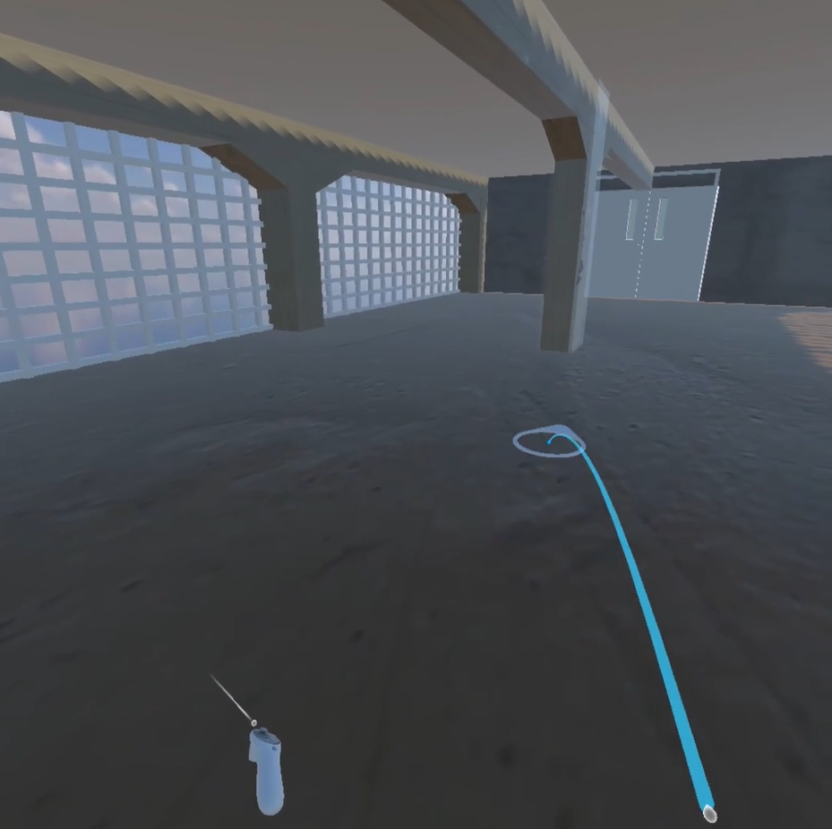
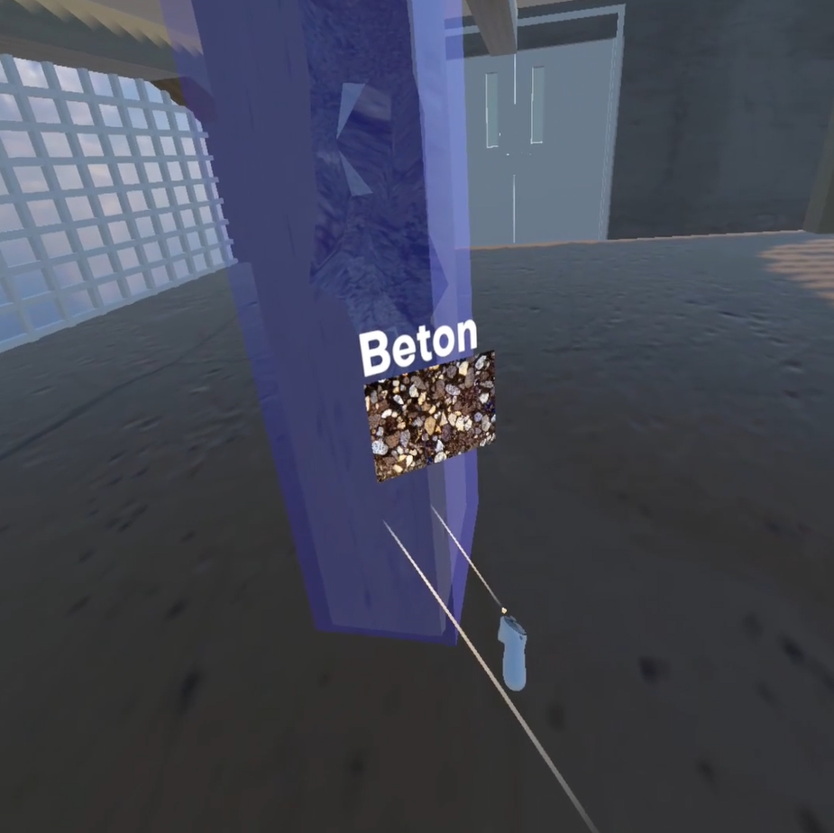

# Universe of Materials

We've all been there: you stumble briefly and end up in the concrete pit...

This project is the submission of group 9 to the [XR Hackathon 2025](https://www.hs-anhalt.de/en/hochschule-anhalt/profil/projekte/praxwerk/translate-to-english-xr-hackathon.html) at Anhalt University.

## Experience the Microscopic World of Concrete in VR

Do you know the feeling when knowledge is taught in a dry way? You may have experienced it countless times - at school, at university, at college. Listening, taking notes, learning by heart. Frontal teaching.

Instead of just talking about it, we invite users to experience concrete on a completely new level. We invite *you* to the Bauhaus.

|                                                     |                                                   |
| --------------------------------------------------- | ------------------------------------------------- |
|  |  |

One click - and suddenly you are drawn in. You shrink, immersing yourself in the microscopic world of concrete.

And it's not just a visual spectacle - it's interactive!  
You can interact with the particles, move them and explore their structure. And exciting information appears with every touch: How is concrete made up? Why is it so stable? How does its structure influence the way we build?

Learning doesn't just mean understanding - it means experiencing it. And that is exactly what we make possible.

## Full Demo

<video controls src="./media/demo.mp4" title="Demo"></>

## How to Get Started

1. Download and install Unity 6000.0.36f1 from [here](https://unity.com/releases/editor/archive).
2. Clone this repo.
3. Open the project in Unity.
4. Add all scenes to your build profile.

### Building the Project

#### Valve Index

1. Add Valve Index Controller interaction support.
2. Build and enjoy!
